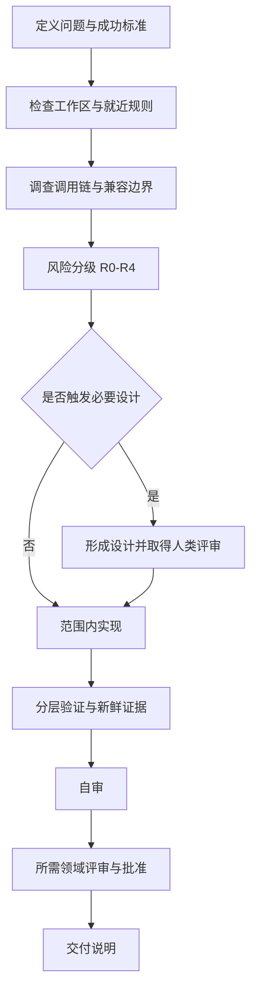

# ReeYin AI Obsidian Vault Implementation Plan

> **For agentic workers:** REQUIRED SUB-SKILL: Use superpowers:subagent-driven-development (recommended) or superpowers:executing-plans to implement this plan task-by-task. Steps use checkbox (`- [ ]`) syntax for tracking.

**Goal:** 在用户桌面创建可直接由 Obsidian 打开的 ReeYin AI 工作流知识库，提供管理与开发双入口，并可追溯地索引现有规则、设计、计划和测试资料。

**Architecture:** 先只读清点 ReeYin-V 中的事实来源，再在新的桌面目录中建立标准 Markdown Vault。原始文档复制为带统一 YAML 和来源区块的快照，派生笔记只依据确定性文件名和原文明示信息生成索引，不推断进度、风险或评审状态。

**Tech Stack:** UTF-8 Markdown、YAML frontmatter、Obsidian Wiki links、Mermaid、PowerShell 只读扫描与 R0 验证。

---

## File Map

实施阶段只创建桌面 Vault；不修改 ReeYin-V 的代码、配置或原始资料。

- `00-入口/首页.md`：Vault 总入口和快照声明。
- `00-入口/管理视图.md`：主题、时间、资料覆盖和人工门禁入口。
- `00-入口/开发视图.md`：AI 开发生命周期导航。
- `01-工作流/AI开发全流程.md`：贡献流程的 Mermaid 总图和阶段说明。
- `01-工作流/风险分级-R0至R4.md`：风险等级、最低门禁和 AI 权限边界。
- `01-工作流/验证与证据门禁.md`：分层验证及证据记录要求。
- `01-工作流/人类授权边界.md`：评审、批准、设备和生产数据边界。
- `02-项目地图/全部主题.md`：按主题列出设计、计划和测试链接。
- `02-项目地图/按时间浏览.md`：按日期倒序展示资料。
- `02-项目地图/按领域浏览.md`：按确定性关键词分组，不能确认的资料进入 `unknown`。
- `02-项目地图/设计与计划对应表.md`：精确主题标识的对应关系与资料缺口。
- `03-设计快照/*.md`：`docs/superpowers/specs/*.md` 的可追溯快照。
- `04-实施计划快照/*.md`：`docs/superpowers/plans/*.md` 的可追溯快照。
- `05-测试与验证快照/*.md`：`docs/testing/*.md` 的可追溯快照。
- `06-规则快照/*.md`：根规则、贡献流程和 `docs/development/*.md` 快照。
- `07-模板/*.md`：任务卡、风险评估、验证证据和交付检查表。
- `99-元数据/来源清单.md`：来源、分类、处理结果和异常。
- `99-元数据/同步说明.md`：一次性快照边界和再次同步步骤。
- `99-元数据/词汇表.md`：R0-R4、事实、判断、假设、风险、未验证等术语。

### Task 1: Inventory Sources And Reserve A New Desktop Target

**Files:**
- Read: `AGENTS.md`
- Read: `CONTRIBUTING.md`
- Read: `docs/development/*.md`
- Read: `docs/superpowers/specs/*.md`
- Read: `docs/superpowers/plans/*`
- Read: `docs/testing/*.md`
- Create: `%USERPROFILE%\Desktop\ReeYin AI 工作流\`，如已存在则创建 `%USERPROFILE%\Desktop\ReeYin AI 工作流-YYYYMMDD-HHmmss\`

- [ ] **Step 1: Recheck repository and target state**

Run:

```powershell
Get-Location
Get-ChildItem -Force | Select-Object Name,Mode
Get-ChildItem -Force "$env:USERPROFILE\Desktop" | Where-Object Name -Like 'ReeYin AI 工作流*'
```

Expected: 当前目录为 ReeYin-V；桌面同名目录清单被明确记录。若 Git 元数据仍不可用，记录“工作区状态未验证”，不得假设工作区干净。

- [ ] **Step 2: Produce a deterministic source inventory**

Run:

```powershell
rg --files docs/development docs/superpowers/specs docs/superpowers/plans docs/testing
```

Add `AGENTS.md` and `CONTRIBUTING.md` to the inventory explicitly. Record counts for rules, Markdown designs, Markdown plans, tests, and non-Markdown plan files.

- [ ] **Step 3: Choose a non-overwriting target path**

If `%USERPROFILE%\Desktop\ReeYin AI 工作流` does not exist, use it. Otherwise generate a timestamped sibling and record the exact path. Do not delete, merge, or overwrite an existing Vault.

### Task 2: Create Vault Skeleton And Derived Workflow Notes

**Files:**
- Create: all files under `00-入口/`, `01-工作流/`, `07-模板/`, and `99-元数据/` listed in File Map
- Create: `.obsidian/app.json`

- [ ] **Step 1: Create directories**

Create the exact directory tree from the approved design, plus `.obsidian`. Use `New-Item -ItemType Directory` only against the selected new target.

- [ ] **Step 2: Add minimal Obsidian configuration**

Create `.obsidian/app.json` with:

```json
{
  "newLinkFormat": "relative",
  "useMarkdownLinks": false,
  "showUnsupportedFiles": true
}
```

- [ ] **Step 3: Write the three entry notes**

Each entry note must contain YAML `type: derived`, `snapshot_at`, a snapshot warning, and Wiki links to the next navigation level. `首页.md` must link to both `[[管理视图]]` and `[[开发视图]]`.

- [ ] **Step 4: Write workflow notes from repository rules**

`AI开发全流程.md` must present this exact lifecycle:



The remaining workflow notes must summarize the approved source rules and link to the corresponding files in `06-规则快照/`. Do not claim that a summary overrides the source snapshots.

- [ ] **Step 5: Write four reusable templates**

Templates must contain explicit fields for success criteria, non-goals, R0-R4 rationale, facts/judgments/assumptions/risks/unverified items, exact validation evidence, compatibility, rollback, human review, approvals, and residual risk. Device or production operations must state that AI cannot execute R4 operations.

### Task 3: Create Traceable Source Snapshots

**Files:**
- Create: `03-设计快照/*.md`
- Create: `04-实施计划快照/*.md`
- Create: `05-测试与验证快照/*.md`
- Create: `06-规则快照/*.md`
- Modify: `99-元数据/来源清单.md`

- [ ] **Step 1: Decode every Markdown source as UTF-8**

Run `Get-Content -Raw -Encoding utf8` for each source before copying. On failure, record `unreadable` in the source manifest and do not create a fabricated snapshot.

- [ ] **Step 2: Prepend normalized metadata**

Use this schema for each snapshot:

```yaml
---
type: design
domain: unknown
date: 2026-07-13
source_path: docs/superpowers/specs/example.md
snapshot_at: 2026-07-13T14:30:00+08:00
risk: unknown
status: unknown
---
```

Replace `type`, `date`, `source_path`, and `snapshot_at` with observed values. Set `risk` and `status` only when the source explicitly states them; otherwise retain `unknown`.

- [ ] **Step 3: Preserve source bodies and append provenance**

After the original body, append:

```markdown
---

> [!info] 快照来源
> 此笔记是 ReeYin-V 仓库资料的只读快照。请以 `source_path` 指向的仓库文件为事实来源，并核对 `snapshot_at`。
```

Do not reformat or rewrite the original body beyond adding metadata, provenance, and confirmed Wiki links.

- [ ] **Step 4: Record non-Markdown plan sources**

List Word documents and generator scripts in `99-元数据/来源清单.md` with status `indexed-only`. Do not execute scripts or convert Word content.

### Task 4: Build Deterministic Project Maps

**Files:**
- Create: `02-项目地图/全部主题.md`
- Create: `02-项目地图/按时间浏览.md`
- Create: `02-项目地图/按领域浏览.md`
- Create: `02-项目地图/设计与计划对应表.md`
- Modify: confirmed snapshot pairs in `03-设计快照/` and `04-实施计划快照/`

- [ ] **Step 1: Derive canonical topic keys**

For design files, remove the leading `YYYY-MM-DD-` and trailing `-design`. For plan files, remove the leading `YYYY-MM-DD-` and a trailing `-implementation` when present. Exact remaining key equality creates a confirmed pair; all other relationships remain unconfirmed.

- [ ] **Step 2: Generate the design-plan matrix**

Use columns `主题`, `设计`, `实施计划`, `测试/验证`, and `关系依据`. For absent items write `未发现对应项`; do not write `未实施` or `未测试`.

- [ ] **Step 3: Generate time and domain indexes**

Dates come only from explicit filename prefixes. Domain grouping uses documented, deterministic keywords such as `alarm`, `acs`, `trajectory`, `wafer`, `camera`, and `control-card`; unmatched files go to `unknown`. Record the keyword mapping in `99-元数据/同步说明.md`.

- [ ] **Step 4: Add backlinks only for confirmed pairs**

Add a `相关资料` section to confirmed design and plan snapshots. Put title/date similarities that do not satisfy exact key equality into a separate `可能相关` section in the matrix only.

### Task 5: Validate The Vault As An R0 Artifact

**Files:**
- Inspect: all files in the new desktop Vault
- Modify: only generated Vault files that fail validation

- [ ] **Step 1: Verify source and snapshot counts**

Compare the Task 1 inventory with generated files by category. Expected: every readable Markdown source has exactly one snapshot; every non-Markdown plan source has exactly one `indexed-only` manifest entry.

- [ ] **Step 2: Verify UTF-8 and YAML frontmatter**

Read every `.md` with `Get-Content -Raw -Encoding utf8`. Snapshot and derived files must start with `---`, contain the required metadata keys, and close frontmatter before the body.

- [ ] **Step 3: Verify internal links**

Extract `[[...]]` targets, ignore aliases after `|` and headings after `#`, and confirm each target resolves to exactly one Markdown note in the Vault. Expected: zero unresolved and zero ambiguous internal links.

- [ ] **Step 4: Verify Mermaid fences**

For every Markdown file, count fenced code delimiters and `mermaid` openings. Expected: all fences balanced; each Mermaid block has a closing fence.

- [ ] **Step 5: Scan for unsupported certainty and sensitive data**

Review derived notes for claims such as `已完成`, `已实施`, `已测试`, `已批准`, and `可发布`. Each occurrence must be directly supported by source text or rewritten as a neutral资料状态. Scan generated content for credential-like strings and ensure none were introduced.

- [ ] **Step 6: Perform the manual navigation check**

Open the Vault in Obsidian only if the user authorizes the GUI action. Check `首页 → 管理视图`, `首页 → 开发视图`, and at least three topic chains. Record environment, steps, expected result, actual result, executor, time, and screenshots when available. If GUI authorization is not provided, mark this check `未验证` and report the impact.

### Task 6: Deliver Evidence And Operating Notes

**Files:**
- Modify: `99-元数据/来源清单.md`
- Modify: `99-元数据/同步说明.md`

- [ ] **Step 1: Record final evidence**

Record exact commands, Asia/Shanghai execution timestamps, environment, exit codes, and available error/failure/skip counts. Fields not supplied by a tool must be `不适用`, never estimated.

- [ ] **Step 2: Record compatibility and limitations**

State that the Vault is a timestamped snapshot, repository sources remain unchanged during implementation, Word content is indexed only, and document validation does not establish historical implementation, CI, review, approval, or device status.

- [ ] **Step 3: Record rollback**

Rollback is closing Obsidian and deleting the newly created Vault. Do not perform deletion without a separate explicit user authorization.

- [ ] **Step 4: Report delivery boundaries**

Report the exact Vault path, source/snapshot counts, validation results, unresolved items, compatibility conclusion, residual stale-snapshot risk, and the absence of Git commit/push/deploy/device operations.

## Plan Constraints

- The repository rule forbidding AI-created Git commits overrides the planning skill's normal frequent-commit recommendation.
- Desktop writes require explicit filesystem approval when the implementation begins.
- Opening Obsidian is a separate GUI action and requires explicit approval.
- No subagent may be used unless the selected execution workflow explicitly authorizes it.
