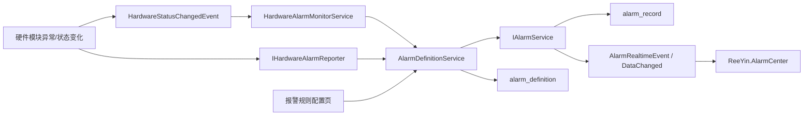

# ReeYin-V 硬件报警监控与自定义扩展设计

## 背景

当前报警中心已经完成了“活动报警 + 实时事件 + 历史查询 + 统计分析 + 确认/清除 + 导出”的主体闭环：

- `Core\ReeYin-V.Core\Services\Alarm\IAlarmService.cs` 定义报警服务接口。
- `Core\ReeYin-V.Core\Services\Alarm\AlarmService.cs` 实现活动报警内存缓存、实时流、异步持久化、查询统计和导出。
- `Core\ReeYin-V.Core\Services\Alarm\AlarmRecordEntity.cs` 定义 `alarm_record` 表。
- `Application\ReeYin.AlarmCenter` 提供实时报警、历史记录和统计分析页面。
- `Core\ReeYin-V.Core\Events\Hardware\HardwareStatusChangedEvent.cs` 已能广播硬件状态，但当前状态变化没有统一转换为报警。

硬件模块侧仍然存在分散处理的问题：PLC、Motion、Sensor 等模块多以 `NodeStatus.Error`、`HardwareState.Error`、日志或 UI 消息表达异常，没有统一进入 `IAlarmService`。因此需要在不破坏现有报警中心的前提下，增加硬件报警统一上报、自动监控和自定义规则配置能力。

## 设计目标

- 保持现有 `AlarmService` 和 `ReeYin.AlarmCenter` 主流程稳定，优先做增量扩展。
- 建立硬件报警统一入口，硬件模块只依赖 `ReeYin_V.Core`，不依赖 `ReeYin.AlarmCenter` UI 项目。
- 支持基于 `HardwareState` 的自动监控，也支持硬件模块在异常出口主动上报。
- 支持用户自定义新增报警定义，包括编码、名称、来源、分类、等级、确认策略、清除策略、防抖和节流。
- 支持 PLC、Motion/ZMotion、Truelight3D 作为第一批试点接入。
- 设计向工业报警管理常见能力演进：防抖、抑制、搁置、维护停用、报警风暴控制、审计和 KPI。

## 非目标

- 本阶段不重写 `AlarmService` 的核心生命周期。
- 本阶段不拆分现有 `alarm_record` 表的数据。
- 本阶段不一次性接入所有硬件模块。
- 本阶段不实现远程短信、邮件、企业微信等通知管线。
- 本阶段不强制引入 OPC UA 或第三方 SCADA 框架。

## 外部方案参考

| 方案 | 关键能力 | 对 ReeYin-V 的启发 |
| --- | --- | --- |
| ISA-18.2 报警生命周期 | 报警哲学、识别、合理化、设计、实施、运行、维护、监控评估、变更管理 | 需要把“报警定义”和“变更记录”从代码中抽出来，形成可维护规则 |
| EEMUA 191 | 优先级、抑制、防抖、搁置、报警负载和操作员响应 | 优先补齐防抖、节流、站立报警、报警风暴统计 |
| OPC UA Alarms & Conditions | Active、Acked、Confirmed、Shelved、Suppressed、OutOfService、Latched、OnDelay | 可作为后续状态字段和生命周期语义参考 |
| Ignition Alarming | 报警 Journal、状态表、动态属性、通知管线、搁置和确认 | 当前已有 Journal 雏形，可新增规则页和后续通知管线 |
| Prometheus Alertmanager | 分组、去重、静默、抑制、路由 | 可借鉴“父报警抑制子报警”和“报警风暴控制” |

## 当前项目能力总结

### Core 报警服务

现有能力：

- `AddAlarm(AlarmRaiseRequest)` 新增或重复触发报警。
- `ClearAlarm(code, source, user, note, location)` 按编码、来源、位置清除活动报警。
- `ConfirmAlarm(id, user, note)` / `AcknowledgeAsync(...)` 确认活动报警。
- `ClearAsync(activeId, user, note)` 按生命周期 Id 清除活动报警。
- `GetActiveAlarmsAsync(...)` 从内存返回活动报警。
- `GetHistoryPageAsync(...)` 和 `GetHistoryAsync(...)` 查询持久化历史。
- `GetStatisticsAsync(...)` 返回趋势、类型分布、来源分布。
- `GetRealtimeFeedAsync(...)` 返回最近实时事件。
- `ExportHistoryAsync(...)` 导出 CSV 或 ExcelXml。

关键实现特征：

- 活动报警去重键为 `Code + Source + Location`。
- 状态变更先更新内存，再通过 `Channel<PersistenceWorkItem>` 异步写库。
- 通过 `AlarmRealtimeEvent` 和 `DataChanged` 推送 UI 刷新。
- `ExtraData` 已可承载结构化诊断信息。

### AlarmCenter UI

现有能力：

- 实时报警页：活动报警列表、报警详情、确认、清除、实时事件流、暂停刷新。
- 历史记录页：时间、等级、来源、关键字筛选，分页，CSV/Excel 导出。
- 统计分析页：趋势、类型分布、来源分布图表。
- 顶部看板：当前活动、待确认、严重报警、今日触发、历史总量。

### 硬件状态基础

已有基础：

- `HardwareState` 枚举包含 `NotConnected`、`Connecting`、`Connected`、`Initializing`、`Ready`、`Running`、`Complete`、`Error`、`Recovering`、`Closed` 等状态。
- `HardwareStatusChangedEvent` 可发布 `HardwareStatus`。
- `HardwareStatusViewModel` 已订阅状态事件并展示硬件状态。
- `SensorBase.State` 已在状态变化时发布 `HardwareStatusChangedEvent`。

主要缺口：

- `HardwareStatusChangedEvent` 只用于状态显示，不会产生报警。
- 硬件状态的 `Describe` 为空，缺少错误码、异常信息、设备位置信息。
- PLC、Motion、Camera、LightController 等硬件基类对状态事件支持不统一。

## 总体架构



设计原则：

- `IAlarmService` 继续只负责报警生命周期，不直接理解 PLC、运动卡、传感器等硬件语义。
- `IHardwareAlarmReporter` 负责把硬件语义转换为 `AlarmRaiseRequest`。
- `AlarmDefinitionService` 负责读取内置规则和用户自定义规则。
- `HardwareAlarmMonitorService` 负责把状态事件转换成报警和恢复清除。
- `ReeYin.AlarmCenter` 只展示最终报警数据和提供规则配置 UI。

## 新增 Core 目录

建议新增：

```text
Core\ReeYin-V.Core\Services\Alarm\Definitions
Core\ReeYin-V.Core\Services\Alarm\Hardware
Core\ReeYin-V.Core\Services\Alarm\Monitoring
```

建议文件：

```text
Definitions\AlarmDefinitionEntity.cs
Definitions\AlarmDefinitionInfo.cs
Definitions\AlarmDefinitionQuery.cs
Definitions\IAlarmDefinitionService.cs
Definitions\AlarmDefinitionService.cs

Hardware\IHardwareAlarmReporter.cs
Hardware\HardwareAlarmReporter.cs
Hardware\HardwareAlarmRequest.cs
Hardware\HardwareAlarmCodes.cs
Hardware\HardwareAlarmSources.cs
Hardware\HardwareAlarmCategories.cs
Hardware\HardwareAlarmRuleDefaults.cs

Monitoring\HardwareAlarmMonitorService.cs
Monitoring\HardwareAlarmStatePolicy.cs
Monitoring\HardwareAlarmStateSnapshot.cs
```

二期建议：

```text
Events\AlarmEventEntity.cs
Rules\AlarmSuppressionRuleEntity.cs
Rules\AlarmShelveRecordEntity.cs
Rules\AlarmMaintenanceWindowEntity.cs
```

## 数据模型设计

### AlarmDefinitionEntity

新增表：`alarm_definition`

```csharp
[SugarTable("alarm_definition", TableDescription = "报警定义和硬件报警规则")]
public sealed class AlarmDefinitionEntity
{
    [SugarColumn(IsPrimaryKey = true, Length = 64)]
    public string Id { get; set; } = string.Empty;

    [SugarColumn(Length = 64, IsNullable = false)]
    public string Code { get; set; } = string.Empty;

    [SugarColumn(Length = 128, IsNullable = false)]
    public string Name { get; set; } = string.Empty;

    [SugarColumn(Length = 128, IsNullable = true)]
    public string Category { get; set; } = string.Empty;

    [SugarColumn(Length = 64, IsNullable = true)]
    public string SourceType { get; set; } = string.Empty;

    [SugarColumn(Length = 128, IsNullable = true)]
    public string DefaultSource { get; set; } = string.Empty;

    [SugarColumn(Length = 128, IsNullable = true)]
    public string DefaultLocation { get; set; } = string.Empty;

    public int SeverityValue { get; set; }

    public bool NeedAcknowledge { get; set; } = true;

    public bool AllowManualClear { get; set; } = true;

    public bool AutoClearOnRecovery { get; set; } = true;

    public int DebounceMilliseconds { get; set; } = 0;

    public int ThrottleSeconds { get; set; } = 1;

    public bool Enabled { get; set; } = true;

    public bool IsSystem { get; set; }

    [SugarColumn(Length = 512, IsNullable = true)]
    public string SuggestedAction { get; set; } = string.Empty;

    [SugarColumn(ColumnDataType = "TEXT", IsNullable = true)]
    public string ExtraTemplateJson { get; set; } = string.Empty;

    public DateTime CreatedAt { get; set; } = DateTime.Now;

    public DateTime UpdatedAt { get; set; } = DateTime.Now;
}
```

索引建议：

- `Code` 唯一索引。
- `SourceType + Enabled` 普通索引。
- `Category + SeverityValue` 普通索引。

### AlarmEventEntity（二期）

新增表：`alarm_event`

用途：保存每次 Raised、Repeated、Confirmed、Cleared、Shelved、Suppressed 的独立流水，弥补当前 `alarm_record` 只偏生命周期快照的问题。

字段建议：

- `Id`
- `AlarmId`
- `Code`
- `Source`
- `Location`
- `EventKind`
- `SeverityValue`
- `EventTime`
- `Operator`
- `Message`
- `ExtraDataJson`

## 接口设计

### IHardwareAlarmReporter

```csharp
public interface IHardwareAlarmReporter
{
    AlarmInfo ReportConnectionFailed(
        string source,
        string location,
        string message,
        Exception? exception = null,
        IDictionary<string, object?>? extraData = null);

    AlarmInfo ReportDisconnected(
        string source,
        string location,
        string message,
        Exception? exception = null,
        IDictionary<string, object?>? extraData = null);

    AlarmInfo ReportInitializationFailed(
        string source,
        string location,
        string message,
        Exception? exception = null,
        IDictionary<string, object?>? extraData = null);

    AlarmInfo ReportOperationFailed(
        string source,
        string location,
        string operation,
        string message,
        Exception? exception = null,
        IDictionary<string, object?>? extraData = null);

    AlarmInfo ReportSafetyError(
        string source,
        string location,
        string message,
        Exception? exception = null,
        IDictionary<string, object?>? extraData = null);

    AlarmInfo ReportNoData(
        string source,
        string location,
        string message,
        IDictionary<string, object?>? extraData = null);

    AlarmInfo Report(HardwareAlarmRequest request);

    bool Clear(
        string code,
        string source,
        string location,
        string? user = null,
        string? note = null);
}
```

### HardwareAlarmRequest

```csharp
public sealed class HardwareAlarmRequest
{
    public string Code { get; set; } = string.Empty;
    public string Name { get; set; } = string.Empty;
    public string Category { get; set; } = string.Empty;
    public string Source { get; set; } = string.Empty;
    public string SourceType { get; set; } = string.Empty;
    public string Location { get; set; } = string.Empty;
    public string Message { get; set; } = string.Empty;
    public AlarmSeverity? Severity { get; set; }
    public string Operation { get; set; } = string.Empty;
    public string ErrorCode { get; set; } = string.Empty;
    public bool? NeedAcknowledge { get; set; }
    public bool? AllowManualClear { get; set; }
    public Exception? Exception { get; set; }
    public IDictionary<string, object?> ExtraData { get; set; } = new Dictionary<string, object?>();
}
```

### IAlarmDefinitionService

```csharp
public interface IAlarmDefinitionService
{
    Task InitializeAsync(CancellationToken cancellationToken = default);

    Task<IReadOnlyList<AlarmDefinitionInfo>> GetDefinitionsAsync(
        AlarmDefinitionQuery query,
        CancellationToken cancellationToken = default);

    Task<AlarmDefinitionInfo?> FindByCodeAsync(
        string code,
        CancellationToken cancellationToken = default);

    Task SaveAsync(
        AlarmDefinitionInfo definition,
        string operatorName,
        CancellationToken cancellationToken = default);

    Task SetEnabledAsync(
        string code,
        bool enabled,
        string operatorName,
        CancellationToken cancellationToken = default);

    AlarmRaiseRequest BuildRaiseRequest(HardwareAlarmRequest request);
}
```

## PrismProvider 扩展

在 `PrismProvider` 构造函数中增加依赖：

```csharp
IHardwareAlarmReporter hardwareAlarmReporter,
IAlarmDefinitionService alarmDefinitionService
```

新增静态属性：

```csharp
public static IHardwareAlarmReporter HardwareAlarmReporter { get; private set; }

public static IAlarmDefinitionService AlarmDefinitionService { get; private set; }
```

这样历史模块可以继续使用低改动入口：

```csharp
PrismProvider.HardwareAlarmReporter.ReportOperationFailed(...);
```

新模块或可 DI 的模块优先构造注入 `IHardwareAlarmReporter`。

## 内置报警码

```text
HW.COMM.CONNECTION_FAILED
HW.COMM.DISCONNECTED
HW.INITIALIZATION_FAILED
HW.OPERATION_FAILED
HW.SAFETY_ERROR
HW.CONFIG.INVALID

HW.PLC.HEARTBEAT_TIMEOUT
HW.PLC.READ_WRITE_FAILED
HW.PLC.COMMAND_TIMEOUT

HW.MOTION.CONTROLLER_ERROR
HW.MOTION.SERVO_ALARM
HW.MOTION.LIMIT_TRIGGERED
HW.MOTION.SAFETY_ERROR

HW.SENSOR.ACQUIRE_FAILED
HW.SENSOR.READ_RESULT_FAILED
HW.SENSOR.NO_DATA
HW.SENSOR.Z_AXIS_FAILED

HW.CAMERA.CAPTURE_FAILED
HW.LIGHT.CONTROL_FAILED
```

## 等级和清除策略

| 场景 | 默认等级 | 需要确认 | 允许手动清除 | 自动清除 |
| --- | --- | --- | --- | --- |
| 连接失败 | Error | 是 | 否 | 重连成功 |
| 断线 | Error | 是 | 否 | 恢复连接 |
| 初始化失败 | Error | 是 | 是 | 初始化成功 |
| 操作失败 | Error | 是 | 是 | 下一次同类操作成功 |
| 超时 | Warning/Error | 是 | 是 | 条件达成或流程复位 |
| 安全异常 | Fatal | 是 | 否 | 硬件复位且安全条件恢复 |
| 无数据 | Warning/Error | 是 | 是 | 下一次获取有效数据 |
| 配置错误 | Warning/Error | 是 | 是 | 配置修复 |

## HardwareState 自动映射

`HardwareAlarmMonitorService` 订阅 `HardwareStatusChangedEvent`，维护每个硬件的最近状态。

默认映射：

| HardwareState | 动作 |
| --- | --- |
| NotConnected | 触发 `HW.COMM.DISCONNECTED` |
| Error | 触发 `HW.OPERATION_FAILED` 或规则指定编码 |
| Closed | 如非正常关机流程，触发断线；正常关闭不报警 |
| Connected | 清除连接失败/断线 |
| Ready | 清除连接失败/断线/初始化失败 |
| Complete | 清除运行类可恢复报警 |
| Recovering | 不新增报警，只更新 ExtraData 或状态说明 |
| Running | 不新增报警 |
| Initializing | 不新增报警，超时由监控策略触发 |

防抖策略：

- 同一 `Code + Source + Location` 进入异常状态后延迟 `DebounceMilliseconds` 再触发。
- 在防抖窗口内恢复正常则不触发。
- 默认状态类报警防抖 500ms，通信类 1000ms，安全类 0ms。

节流策略：

- 同一 `Code + Source + Location` 在 `ThrottleSeconds` 内重复上报，由 Reporter 跳过。
- 安全类报警不跳过，但仍由 `AlarmService` 合并为同一活动报警。

## 硬件试点接入

### PLC

接入点：

- `Tools\Hardware\HardWareTool.PLC\Models\PLCModel.cs`
- `SingleExecute(PLCOrder Order)`
- `CurPLC.ReadPLCPara(...)`
- `CurPLC.WritePLCPara(...)`
- 判断值等待超时逻辑

建议：

- 读单地址返回空值：`HW.PLC.READ_WRITE_FAILED`
- 读写异常 catch：`HW.PLC.READ_WRITE_FAILED`
- 等待判断值超时：`HW.PLC.COMMAND_TIMEOUT`
- 下一次读写成功：清除相同 `Code + Source + Location`

Location 建议：

```text
PLC:{CurPLC.NickName}:{Order.Addr}
```

### Motion/ZMotion

接入点：

- `Tools\Hardware\HardwareTool.Motion\Models\MotionModel.cs`
- `ControlCard` 为空或未连接
- 各类插补、点动、线运动、IO 操作失败
- 限位、伺服、控制卡状态异常

建议：

- 控制卡不可用：`HW.MOTION.CONTROLLER_ERROR`
- 运动执行失败：`HW.OPERATION_FAILED`
- 限位触发：`HW.MOTION.LIMIT_TRIGGERED`
- 伺服报警：`HW.MOTION.SERVO_ALARM`
- 安全类异常：`HW.MOTION.SAFETY_ERROR`

Location 建议：

```text
Motion:{ControlCard.NickName}:Axis{axisNo}
```

### Truelight3D

接入点：

- `Hardware\Sensor\ReeYin.Hardware.Sensor.Truelight3D\Truelight3DSensor.cs`
- `Init()`
- `Api.Connect()`
- `StartCollect()`
- `ReadPreviewFrame()`
- `ReadScanResult()`
- Z 轴相关操作

建议：

- 初始化失败：`HW.INITIALIZATION_FAILED`
- 连接失败：`HW.COMM.CONNECTION_FAILED`
- 开始采集失败：`HW.SENSOR.ACQUIRE_FAILED`
- 读取结果失败：`HW.SENSOR.READ_RESULT_FAILED`
- 点云/高度数据为空：`HW.SENSOR.NO_DATA`
- Z 轴操作失败：`HW.SENSOR.Z_AXIS_FAILED`

Location 建议：

```text
Sensor:Truelight3D:{NickName or IP}
```

## 报警中心 UI 扩展

### 新增页面：报警规则

页面放在 `Application\ReeYin.AlarmCenter\Views\AlarmDefinitionsView.xaml`。

功能：

- 规则列表：编码、名称、分类、来源类型、等级、启用、系统内置、自定义。
- 编辑面板：名称、分类、默认来源、默认位置、等级、确认策略、手动清除、自动恢复、防抖、节流、建议处理动作。
- 操作：新增、复制、保存、启用/禁用、导入、导出。
- 系统内置规则不允许删除，只允许调整启用状态、等级和处理动作。

### 新增页面：硬件监控

页面放在 `Application\ReeYin.AlarmCenter\Views\HardwareAlarmMonitorView.xaml`。

功能：

- 展示硬件状态、最近报警、最后恢复时间。
- 显示设备名、类型、位置、当前 `HardwareState`、连接状态。
- 支持按硬件类型过滤。
- 显示状态报警映射规则。

### 现有页面增强

实时报警页：

- 详情区显示 `SuggestedAction`。
- 详情区格式化展示 `ExtraData`。
- 增加“来源类型”和“分类”显示。

历史记录页：

- 增加分类筛选。
- 增加是否包含活动报警筛选。

统计页：

- 增加站立报警 TOP。
- 增加重复触发 TOP。
- 增加来源类型分布。

## 实施阶段

### 阶段 1：规则和 Reporter 基础

- 新增 `AlarmDefinitionEntity` 并加入 `CoreModule.CodeFirst.InitTables(...)`。
- 新增 `AlarmDefinitionService`，启动时写入内置报警定义。
- 新增 `IHardwareAlarmReporter` 和默认实现。
- 扩展 `PrismProvider` 静态入口。
- 单元验证 `BuildRaiseRequest` 的默认值、禁用规则、防抖和节流。

### 阶段 2：状态自动监控

- 新增 `HardwareAlarmMonitorService`，注册为单例并 `AutoInitialize=true`。
- 订阅 `HardwareStatusChangedEvent`。
- 实现 `HardwareState` 映射、恢复清除、防抖和节流。
- 确认 `SensorBase.State` 产生的状态能进入报警中心。

### 阶段 3：试点主动上报

- PLC 接入读写失败、命令超时和恢复清除。
- Motion 接入控制卡、限位、伺服、安全异常。
- Truelight3D 接入连接、采集、读结果、无数据、Z 轴异常。
- 所有试点必须保证 Reporter 失败不影响原硬件流程。

### 阶段 4：UI 配置

- 新增“报警规则”页面。
- 新增“硬件监控”页面。
- 扩展历史和统计筛选。
- 增加规则导入/导出 JSON。

### 阶段 5：治理能力

- 新增 `AlarmEventEntity` 审计流水。
- 增加 Shelve、Suppress、OutOfService、Latched 状态。
- 增加父报警抑制子报警规则。
- 增加报警风暴检测和 KPI。

## 测试策略

### Core 单元测试

- 内置规则初始化后可查询。
- 用户自定义规则可新增、修改、禁用。
- 禁用规则不上报。
- Reporter 能按规则生成 `AlarmRaiseRequest`。
- 相同活动键在节流窗口内不会重复调用 `IAlarmService.AddAlarm`。
- 安全类报警不允许手动清除。
- 自动恢复能调用 `ClearAlarm`。

### 集成验证

- 模拟 `HardwareStatusChangedEvent(NotConnected)`，报警中心出现断线报警。
- 模拟 `HardwareStatusChangedEvent(Ready)`，断线报警清除并进入历史。
- PLC 读地址失败后实时页出现 PLC 报警。
- PLC 下一次读写成功后相关报警清除。
- Motion 限位/伺服报警为 Fatal 或 Error，并按规则禁止手动清除。
- Truelight3D 无数据时出现传感器报警，下一次有效数据后清除。

### 构建验证

建议命令：

```powershell
dotnet build Core\ReeYin-V.Core\ReeYin_V.Core.csproj --no-restore
dotnet build Application\ReeYin.AlarmCenter\ReeYin.AlarmCenter.csproj --no-restore
```

## 风险和规避

- 风险：硬件状态事件频率高，导致 UI 和数据库压力增加。规避：Reporter 层节流，Monitor 层防抖，`AlarmService` 继续按活动键合并。
- 风险：手动清除安全类报警导致现场误判。规避：规则层默认 `AllowManualClear=false`，恢复必须来自硬件状态。
- 风险：现有硬件模块状态字段不统一。规避：先用 `HardwareStatusChangedEvent` 做通用监控，再对典型模块主动上报。
- 风险：自定义规则误删系统规则。规避：`IsSystem=true` 的规则禁止删除，只允许启用/禁用和部分字段编辑。
- 风险：报警定义和活动报警字段不一致。规避：`AlarmDefinitionService.BuildRaiseRequest` 作为唯一转换入口。

## 待确认事项

- 报警规则是否需要权限控制，例如只有管理员能新增/禁用规则。
- 自定义规则是否需要按项目保存，还是全局保存到当前主数据库。
- 安全类报警是否允许管理员强制清除，还是必须由硬件恢复清除。
- 是否需要在第一阶段就加入 `AlarmEventEntity` 审计流水。
- 是否需要支持英文/中文双语报警名称和建议处理动作。

## 推荐结论

优先执行“阶段 1 + 阶段 2 + PLC/Truelight3D 小范围试点”。这样能在最小改动下让硬件状态和硬件异常进入报警中心，同时为后续用户自定义报警、报警治理和通知管线保留扩展点。
