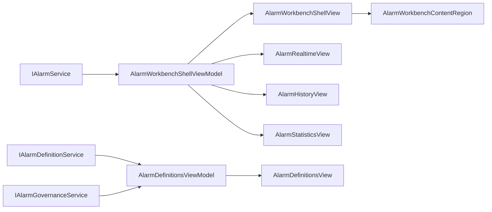

# ReeYin.AlarmCenter 稳态指挥舱重设计

## 背景

`Application\ReeYin.AlarmCenter` 当前已经包含工作台 Shell、实时报警、历史记录、统计分析和报警定义页面。现有实现以功能闭环为主，页面通过 `AlarmWorkbenchShellViewModel` 和 `AlarmDefinitionsViewModel` 提供数据、命令和 Prism 导航，主要 UI 文件为：

- `Application\ReeYin.AlarmCenter\Views\AlarmWorkbenchShellView.xaml`
- `Application\ReeYin.AlarmCenter\Views\AlarmRealtimeView.xaml`
- `Application\ReeYin.AlarmCenter\Views\AlarmHistoryView.xaml`
- `Application\ReeYin.AlarmCenter\Views\AlarmStatisticsView.xaml`
- `Application\ReeYin.AlarmCenter\Views\AlarmDefinitionsView.xaml`
- `Application\ReeYin.AlarmCenter\Styles\AlarmWorkbenchResources.xaml`

本次重设计选择“稳态指挥舱”方向：深色左侧导航、浅色玻璃化内容面板、清晰的等级色条和处置优先级。目标是在不重写现有业务逻辑和数据服务的前提下，提升报警中心的现场可读性、紧急程度识别、处置入口清晰度和整体一致性。

## 设计目标

- 保留现有 ViewModel、命令、集合和 Prism Region 结构，优先改造 XAML 布局和共享样式。
- 让“当前活动报警、待确认报警、严重报警、实时事件、处置动作”成为首屏视觉重点。
- 统一 Shell、实时、历史、统计、报警定义页面的卡片、表格、按钮、输入框和标题样式。
- 对实时报警页增加更强的分区：活动报警列表、选中报警详情、建议处理动作、实时事件流。
- 对历史记录页固定筛选和导出区，使表格滚动时操作入口稳定。
- 对统计页强化趋势、来源分布、类型分布、站立报警和重复报警的分析感。
- 对报警定义页保留高密度配置能力，但改善导航、列表层级和操作栏。

## 非目标

- 不重写 `IAlarmService`、报警数据库表或硬件报警上报逻辑。
- 不改变现有 `AlarmWorkbenchShellViewModel`、`AlarmDefinitionsViewModel` 的核心职责。
- 不新增远程通知、权限系统、报警生命周期字段或硬件监控新页面。
- 不引入第三方 UI 框架或新的图表库。
- 不一次性拆分大型 ViewModel；只有在编译或布局绑定需要时做小范围辅助属性。

## 用户确认

已在本地浏览器预览中展示三个方向：

- A：稳态指挥舱。
- B：高密度运维台。
- C：轻量企业控制台。

用户选择并批准方向 A。后续实现以方向 A 的页面结构和视觉语言为准。

## 总体视觉语言

### 色彩

- 背景使用浅蓝灰渐变和低透明度径向光晕，弱化纯白空白感。
- 导航使用深海军蓝，强调 AlarmCenter 独立工作台属性。
- 主操作使用蓝色，实时和分析状态使用青色，恢复成功使用绿色。
- Fatal/Error 使用红色，Warning 使用琥珀色，Info 使用蓝色。
- 面板使用半透明白和细边框，保持工业软件的清晰边界。

### 布局

- Shell 采用左侧窄导航栏 + 右侧内容工作区。
- 首屏顶部为指挥栏，展示标题、状态和忙碌反馈。
- KPI 卡片置于导航后的第一视觉层，显示当前活动、待确认、严重报警、今日触发和历史总量。
- 页面内部采用卡片分区，标题区、操作区、表格区和详情区边界明确。

### 组件风格

- 表格行增加左侧等级色条，选中行保留明显背景和前景对比。
- Button、ComboBox、DatePicker、TextBox 使用统一圆角、边框和高度。
- 主要按钮和次要按钮都通过共享样式定义，避免页面内硬编码。
- KPI、趋势卡片、实时事件卡片统一圆角和阴影。

## 页面设计

### 工作台 Shell

文件：`Application\ReeYin.AlarmCenter\Views\AlarmWorkbenchShellView.xaml`

Shell 从当前的左侧卡片导航改为深色窄导航栏。导航项继续绑定 `PageItems`，点击仍然执行 `NavigatePageCommand`，内容区域仍然使用 `AlarmWorkbenchContentRegion`。

顶部指挥栏展示：

- 标题“报警中心”。
- 状态文本 `StatusText`。
- `IsBusy` 对应的进度反馈。
- 当前页面说明。

KPI 区继续绑定 `SummaryCards`，但卡片视觉升级为五张等宽指标卡。每张卡显示 Title、Value、Caption 和 AccentBrush。卡片加入轻量等级色点或顶部强调条。

### 实时报警页

文件：`Application\ReeYin.AlarmCenter\Views\AlarmRealtimeView.xaml`

实时页采用左右分栏：

- 左侧：当前活动报警表格。
- 右侧上部：选中报警详情和处置按钮。
- 右侧下部：实时事件流。

活动报警表格继续绑定 `ActiveAlarms` 和 `SelectedActiveAlarm`。保留现有列：等级、来源、位置、编码、报警项、报警信息、触发时间、持续时长、次数、确认状态。视觉上增加等级色条、等级徽标、选中态和悬停态。

报警详情继续绑定 `SelectedActiveAlarm`。展示项包括：

- 标题、子标题和报警消息。
- 等级徽标。
- 触发时间、最近触发、持续时长、确认状态。
- 确认报警和清除报警按钮。

如果现有模型已经包含 SuggestedAction 或 ExtraData，可直接展示；如果没有，本期只预留 UI 区域，不强制新增业务字段。

实时事件流继续绑定 `RealtimeFeed`。事件卡片展示等级、摘要、消息、动作文本和时间，最新事件置顶。

### 历史记录页

文件：`Application\ReeYin.AlarmCenter\Views\AlarmHistoryView.xaml`

历史页采用上下结构：

- 顶部固定筛选卡片。
- 下方历史报警结果表格。
- 底部分页和结果摘要。

筛选区继续绑定：

- `FilterStartDate`
- `FilterEndDate`
- `LevelOptions`
- `SelectedHistoryLevel`
- `SourceOptions`
- `SelectedHistorySource`
- `HistoryKeyword`

按钮继续绑定：

- `ApplyHistoryFilterCommand`
- `ResetHistoryFilterCommand`
- `ExportCsvCommand`
- `ExportExcelCommand`

结果表格继续绑定 `HistoryAlarms`，保留当前列。分页继续绑定 `PreviousPageCommand`、`NextPageCommand`、`HistoryPagerText` 和 `HistoryResultText`。

### 统计分析页

文件：`Application\ReeYin.AlarmCenter\Views\AlarmStatisticsView.xaml`

统计页保留 LightningChart 绑定，不更换图表库。布局调整为：

- 顶部统计指标卡，绑定 `StatisticCards`。
- 左侧大趋势图，绑定 `TrendChartView`。
- 右侧类型分布和来源分布，绑定 `TypeChartView`、`SourceChartView`、`TypeStatistics`、`SourceStatistics`。
- 下方趋势概览继续绑定 `TrendPoints`。

如果现有数据不足以支持站立报警 TOP 或重复触发 TOP，本次只通过现有 `StatisticCards` 和列表视觉表达，不新增统计接口。

### 报警定义页

文件：`Application\ReeYin.AlarmCenter\Views\AlarmDefinitionsView.xaml`

报警定义页保留 Tab 能力，但视觉上改为治理工作区：

- 左侧规则分类导航：报警定义、报警抑制、报警搁置、通知路由、事件审计。
- 右侧内容区展示对应列表和操作栏。
- 主列表保持高密度表格，便于维护人员查看完整字段。
- 新增、编辑、启停等按钮继续绑定现有命令。

当前 `AlarmDefinitionsView.xaml` 已经包含弹窗编辑器和多个 TabItem。实现时优先通过共享样式和布局容器改造，不改变保存、取消、启停、释放、刷新审计等命令行为。

## 共享资源设计

文件：`Application\ReeYin.AlarmCenter\Styles\AlarmWorkbenchResources.xaml`

共享资源将扩展并统一以下样式：

- `AlarmWorkbenchRootBackground`：页面背景。
- `AlarmCommandBarStyle`：顶部指挥栏。
- `AlarmRailStyle`：深色导航栏。
- `AlarmPageNavButtonStyle`：导航按钮，支持选中态。
- `AlarmCardStyle`：通用卡片。
- `AlarmQueryBarStyle`：筛选卡片。
- `AlarmMetricCardTemplate`：KPI 卡片模板。
- `AlarmPrimaryButtonStyle` 和 `AlarmSecondaryButtonStyle`：主次按钮。
- `AlarmDataGridStyle`、`AlarmColumnHeaderStyle`、`AlarmCellStyle`、`AlarmRowStyle`：表格样式。
- `AlarmBadgeStyle` 或等级模板：等级徽标。
- `AlarmEventCardTemplate`：实时事件流卡片。
- `TrendTileTemplate` 和 `StatisticBarItemTemplate`：统计区模板。

样式应优先复用 `ReeYin_V.UI` 现有资源，例如通用按钮、DataGrid、Expander、主题刷和字体资源。只有在 AlarmCenter 的报警等级、指挥舱布局和卡片层级确实需要时，才新增项目级资源。

## 数据和命令流

本次重设计不改变数据来源。



数据集合和命令保持现状：

- `SummaryCards`
- `ActiveAlarms`
- `RealtimeFeed`
- `HistoryAlarms`
- `StatisticCards`
- `TypeStatistics`
- `SourceStatistics`
- `TrendPoints`
- `Definitions`
- `SuppressionRules`
- `Shelves`
- `NotificationRoutes`
- `AuditItems`

## 可访问性和现场可用性

- 高等级报警不能只依赖颜色，必须同时显示文字等级。
- Fatal/Error/Warning/Info 徽标要有足够对比度。
- 表格选中态要明显，不能被等级色条淹没。
- 按钮和输入框高度保持一致，减少现场触控和鼠标操作误点。
- 历史和定义页保留横向滚动能力，避免字段过多时挤压文字。

## 实施策略

### 阶段 1：共享资源

先改造 `AlarmWorkbenchResources.xaml`，建立通用色板、卡片、按钮、表格、徽标和导航样式。这样后续页面只引用资源，避免重复硬编码。

### 阶段 2：Shell 和实时页

改造 `AlarmWorkbenchShellView.xaml` 和 `AlarmRealtimeView.xaml`。这两页决定整体视觉方向，也是报警中心最高频使用路径。

### 阶段 3：历史和统计页

改造 `AlarmHistoryView.xaml` 和 `AlarmStatisticsView.xaml`，统一筛选区、表格、分页和图表容器。

### 阶段 4：报警定义页

改造 `AlarmDefinitionsView.xaml`。由于该页 XAML 较大，先保持功能和绑定不变，再逐步替换容器和样式。

### 阶段 5：构建和视觉验证

每个阶段完成后执行构建：

```powershell
dotnet build Application\ReeYin.AlarmCenter\ReeYin.AlarmCenter.csproj --no-restore
```

完成后运行主程序或可加载模块的路径，打开报警中心，检查五个页面是否可导航、表格可滚动、命令按钮可用、忙碌状态可见。

## 风险和规避

- 风险：页面样式过度本地化，破坏主系统主题一致性。规避：优先复用 `ReeYin_V.UI` 资源，新增资源只放在 AlarmCenter 共享字典。
- 风险：报警定义页 XAML 大，整页重排容易误改绑定。规避：先替换样式和容器，再调整局部布局，避免改命令和数据路径。
- 风险：LightningChart 在新容器中尺寸异常。规避：保留现有 `LightChartStyle` 基础设置，图表容器使用明确高度和 Stretch 对齐。
- 风险：深色导航与主系统外壳冲突。规避：深色只限 AlarmCenter 内部导航栏，内容区仍为浅色。
- 风险：现场低分辨率屏幕空间不足。规避：关键 Grid 使用 `MinWidth`、`*` 宽度和可滚动表格，导航栏保持窄宽。

## 验收标准

- AlarmCenter 模块构建通过。
- 打开报警中心后默认进入实时报警页。
- Shell 左侧导航可切换实时报警、历史记录、统计分析和报警定义。
- 顶部 KPI 卡片正常显示 `SummaryCards` 内容。
- 实时报警页活动表格、详情区、确认按钮、清除按钮和事件流正常绑定。
- 历史记录页筛选、查询、重置、CSV、Excel、上一页和下一页按钮仍可用。
- 统计分析页趋势图、类型图、来源图和趋势概览正常显示。
- 报警定义页五类管理内容可切换，查询、新增、编辑、启停、释放和刷新审计命令仍可用。
- Fatal/Error/Warning/Info 在表格、详情和事件卡片中有一致的文字和颜色表达。

## 预览文件

本次设计沟通使用本地 HTML 预览辅助确认视觉方向，预览文件位于：

- `.codex_tmp\alarmcenter-redesign-preview.html`
- `.codex_tmp\alarmcenter-direction-a-preview-full.png`

这些文件只用于沟通，不属于最终 WPF 实现交付。
