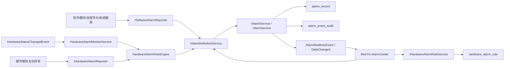

# ReeYin-V 统一报警模块设计

## 背景

当前报警能力已经分布在两个主要区域：

- `Core\ReeYin-V.Core\Services\Alarm` 提供 `IAlarmService`、`AlarmService`、`AlarmRecordEntity`、报警定义、硬件报警上报、治理规则和硬件状态监听。
- `Application\ReeYin.AlarmCenter` 提供报警中心工作台，包含实时报警、历史记录、统计分析和报警定义/治理配置页面。

现有 `AlarmService` 已经适合作为报警生命周期引擎：它支持新增、重复触发、确认、清除、活动报警缓存、实时事件、历史查询、统计、导出和异步持久化。现有硬件扩展也已经具备雏形：`IHardwareAlarmReporter`、`HardwareAlarmReporter`、`AlarmDefinitionService` 和 `HardwareAlarmMonitorService` 可以把部分硬件状态转成报警。

主要缺口是：

- 软件报警没有统一入口，流程节点、算法、配方、系统异常容易继续分散处理。
- 硬件报警的“什么条件触发什么报警”主要靠固定代码，用户自定义能力不足。
- `alarm_definition` 同时承担“报警是什么”和“何时触发”的倾向会让规则越来越难维护。
- AlarmCenter 的定义页已经能维护报警定义和治理规则，但还缺独立的硬件触发规则配置模型。

本设计采用“统一报警生命周期 + 软件/硬件双入口 + 硬件规则可配置”的增量方案，不推翻现有报警服务，只在 Core 中补齐统一上报和规则层。

## 目标

- 保留 `AlarmService` 作为唯一报警生命周期引擎。
- 软件报警和硬件报警都通过统一定义解析后进入 `IAlarmService.AddAlarm`。
- 硬件报警支持用户自定义：设备类型、设备名、位置、触发字段、触发条件、恢复条件、防抖、节流、锁存和启停。
- 报警定义只描述“报警是什么”；硬件规则描述“什么时候触发/恢复”。
- AlarmCenter 展示仍消费 `IAlarmService`，配置页扩展报警定义、硬件规则、治理规则和审计。
- 硬件模块不依赖 `ReeYin.AlarmCenter`，只依赖 `ReeYin_V.Core`。

## 非目标

- 不重写 `AlarmService` 的活动报警、历史、统计和导出主流程。
- 不一次性改造所有硬件模块，先完成 PLC、运动控制、传感器/相机试点。
- 不引入外部 SCADA、OPC UA 或第三方报警框架。
- 不强制将所有旧 UI 一次性重排，只做与规则配置相关的最小 UI 扩展。

## 总体架构



### 职责边界

| 组件 | 职责 |
| --- | --- |
| `IAlarmService` | 报警生命周期：Raise、Repeat、Ack、Clear、查询、统计、导出、事件推送。 |
| `IAlarmDefinitionService` | 管理报警定义，将软件/硬件请求解析为 `AlarmRaiseRequest`。 |
| `ISoftwareAlarmReporter` | 软件侧统一入口，封装流程、算法、配方、系统异常上报和恢复清除。 |
| `IHardwareAlarmReporter` | 硬件侧主动上报入口，封装连接失败、断线、初始化失败、操作失败、安全异常等。 |
| `HardwareAlarmMonitorService` | 监听 `HardwareStatusChangedEvent`，把状态变化送入规则引擎。 |
| `HardwareAlarmRuleEngine` | 根据硬件规则判断触发、恢复、锁存、防抖和节流。 |
| `IHardwareAlarmRuleService` | 管理硬件自定义规则，提供查询、保存、启停、默认规则种子。 |
| `ReeYin.AlarmCenter` | 展示报警结果，维护报警定义、硬件规则、抑制、搁置、通知路由和审计。 |

## 报警生命周期

统一生命周期沿用现有 `AlarmService`：

1. `Raised`：首次触发，写入活动报警和历史记录。
2. `Repeated`：同一 `Code + Source + Location` 再次触发，更新消息、等级、次数和最近触发时间。
3. `Confirmed`：用户确认，记录确认人和确认时间。
4. `Suppressed`：命中抑制规则，不进入活动报警，写审计。
5. `Shelved`：命中搁置规则，暂不作为活动报警提醒，写审计。
6. `Cleared`：自动恢复或人工清除，活动报警转为历史闭环。

活动报警去重键继续使用：

```text
ActiveKey = Code + Source + Location
```

这能保证同一设备同一点位的高频异常只形成一个活动报警，并通过 `OccurrenceCount` 和 `LastRaisedAt` 表达重复触发。

## 报警定义模型

继续使用现有 `alarm_definition`，但语义调整为“报警目录”，软件和硬件共用。

关键字段：

| 字段 | 说明 |
| --- | --- |
| `Code` | 全局唯一报警编码，例如 `HW.PLC.HEARTBEAT_TIMEOUT`。 |
| `Name` | 显示名称。 |
| `Category` | 分类，例如硬件通信、运动安全、流程执行。 |
| `SourceType` | 来源类型，例如 `Software`、`PLC`、`MotionCard`、`Sensor`、`Camera`。 |
| `DefaultSource` | 默认来源，调用方为空时使用。 |
| `DefaultLocation` | 默认位置，调用方为空时使用。 |
| `SeverityValue` | 默认等级。 |
| `NeedAcknowledge` | 是否需要确认。 |
| `AllowManualClear` | 是否允许人工清除。 |
| `AutoClearOnRecovery` | 规则恢复时是否自动清除。 |
| `DebounceMilliseconds` | 默认防抖时间。 |
| `ThrottleSeconds` | 默认节流时间。 |
| `SuggestedAction` | 建议处理动作。 |
| `ExtraTemplateJson` | 默认扩展字段模板。 |

编码建议：

```text
SW.SYSTEM.*
SW.MODULE.*
SW.RECIPE.*
SW.ALGORITHM.*
SW.DATA.*
HW.COMM.*
HW.PLC.*
HW.MOTION.*
HW.SENSOR.*
HW.CAMERA.*
HW.LIGHT.*
HW.SAFETY.*
CUSTOM.SW.*
CUSTOM.HW.*
```

## 软件报警设计

新增 `ISoftwareAlarmReporter`，放在 `Core\ReeYin-V.Core\Services\Alarm\Software`。

### 接口

```csharp
public interface ISoftwareAlarmReporter
{
    AlarmInfo Report(
        string code,
        string source,
        string location,
        string message,
        AlarmSeverity? severity = null,
        IDictionary<string, object?>? extraData = null);

    AlarmInfo ReportModuleFailed(
        int serial,
        string moduleName,
        string message,
        Exception? exception = null);

    AlarmInfo ReportRecipeInvalid(
        string recipeName,
        string parameterName,
        string message);

    AlarmInfo ReportAlgorithmFailed(
        string algorithmName,
        string location,
        string message,
        Exception? exception = null);

    bool Clear(
        string code,
        string source,
        string location,
        string? user = "System",
        string? note = null);
}
```

### 软件报警场景

| 场景 | 编码 | Source | Location | 清除策略 |
| --- | --- | --- | --- | --- |
| 节点执行失败 | `SW.MODULE.EXECUTE_FAILED` | `Module:{模块名}` | `Node:{Serial:D3}` | 下次执行成功清除。 |
| 配方参数非法 | `SW.RECIPE.INVALID_PARAM` | `Recipe:{配方名}` | 参数路径 | 参数修复后清除。 |
| 算法执行失败 | `SW.ALGORITHM.FAILED` | `Algorithm:{算法名}` | 节点或工位 | 下次算法成功清除。 |
| 无有效结果 | `SW.DATA.NO_RESULT` | `Module:{模块名}` | 检测项或节点 | 下次有结果清除。 |
| 系统资源异常 | `SW.SYSTEM.RESOURCE_LOW` | `System` | `Disk` / `Memory` | 指标恢复后清除。 |
| 未处理异常 | `SW.SYSTEM.UNHANDLED_EXCEPTION` | `Shell` | 异常类型 | 人工确认，按定义决定是否可清除。 |

### 与 MVVM/节点生命周期的关系

节点模块应在主 Model 的执行生命周期中上报或清除，不在 ViewModel 构造函数里触发。推荐模式：

- `ExecuteModule()` 捕获异常时调用 `ISoftwareAlarmReporter.ReportModuleFailed(...)`。
- 同一模块下次执行成功后调用 `Clear(...)` 清除同一 `Code + Source + Location`。
- Model 仍继承 `ModelParamBase`，ViewModel 仍使用 `DialogViewModelBase` 和 `InitModelParam<TModel>()`。

## 硬件报警设计

硬件报警有两个入口：

- 主动上报：硬件模块在异常 catch、返回码失败、SDK 事件中调用 `IHardwareAlarmReporter`。
- 状态监听：硬件模块设置 `HardwareState` 时发布 `HardwareStatusChangedEvent`，由 `HardwareAlarmMonitorService` 统一转规则。

现有 `IHardwareAlarmReporter` 保留，建议扩展为支持规则上下文：

```csharp
public interface IHardwareAlarmReporter
{
    AlarmInfo ReportConnectionFailed(string source, string location, string message, Exception? exception = null, IDictionary<string, object?>? extraData = null);
    AlarmInfo ReportDisconnected(string source, string location, string message, Exception? exception = null, IDictionary<string, object?>? extraData = null);
    AlarmInfo ReportInitializationFailed(string source, string location, string message, Exception? exception = null, IDictionary<string, object?>? extraData = null);
    AlarmInfo ReportOperationFailed(string source, string location, string operation, string message, Exception? exception = null, IDictionary<string, object?>? extraData = null);
    AlarmInfo ReportSafetyError(string source, string location, string message, Exception? exception = null, IDictionary<string, object?>? extraData = null);
    AlarmInfo ReportNoData(string source, string location, string message, IDictionary<string, object?>? extraData = null);
    AlarmInfo Report(HardwareAlarmRequest request);
    bool Clear(string code, string source, string location, string? user = null, string? note = null);
}
```

## 硬件自定义规则

新增目录：

```text
Core\ReeYin-V.Core\Services\Alarm\HardwareRules
```

新增表：

```text
hardware_alarm_rule
```

### 数据实体

```csharp
[SugarTable("hardware_alarm_rule", TableDescription = "硬件报警触发和恢复规则")]
public sealed class HardwareAlarmRuleEntity
{
    [SugarColumn(IsPrimaryKey = true, Length = 64)]
    public string Id { get; set; } = string.Empty;

    [SugarColumn(Length = 128, IsNullable = false)]
    public string DefinitionCode { get; set; } = string.Empty;

    [SugarColumn(Length = 128, IsNullable = false)]
    public string Name { get; set; } = string.Empty;

    [SugarColumn(Length = 64, IsNullable = false)]
    public string SourceType { get; set; } = string.Empty;

    [SugarColumn(Length = 128, IsNullable = true)]
    public string SourcePattern { get; set; } = string.Empty;

    [SugarColumn(Length = 128, IsNullable = true)]
    public string LocationPattern { get; set; } = string.Empty;

    [SugarColumn(Length = 32, IsNullable = false)]
    public string TriggerKind { get; set; } = "State";

    [SugarColumn(Length = 128, IsNullable = false)]
    public string TriggerField { get; set; } = string.Empty;

    [SugarColumn(Length = 32, IsNullable = false)]
    public string Operator { get; set; } = "Equals";

    [SugarColumn(Length = 256, IsNullable = true)]
    public string TriggerValue { get; set; } = string.Empty;

    [SugarColumn(Length = 32, IsNullable = false)]
    public string ClearKind { get; set; } = "StateRecovery";

    [SugarColumn(Length = 256, IsNullable = true)]
    public string ClearValue { get; set; } = string.Empty;

    public int DebounceMilliseconds { get; set; }
    public int ThrottleSeconds { get; set; } = 1;
    public bool LatchMode { get; set; }
    public bool Enabled { get; set; } = true;
    public bool IsSystem { get; set; }
    public int Priority { get; set; } = 100;

    [SugarColumn(ColumnDataType = "TEXT", IsNullable = true)]
    public string ExtraTemplateJson { get; set; } = string.Empty;

    public DateTime CreatedAt { get; set; } = DateTime.Now;
    public DateTime UpdatedAt { get; set; } = DateTime.Now;
}
```

### 枚举语义

```csharp
public enum HardwareAlarmTriggerKind
{
    State = 0,
    ErrorCode = 1,
    ExtraData = 2,
    Heartbeat = 3
}

public enum HardwareAlarmOperator
{
    Equals = 0,
    NotEquals = 1,
    GreaterThan = 2,
    GreaterThanOrEqual = 3,
    LessThan = 4,
    LessThanOrEqual = 5,
    Contains = 6,
    BitHasFlag = 7
}

public enum HardwareAlarmClearKind
{
    StateRecovery = 0,
    FieldRecovery = 1,
    ManualOnly = 2
}
```

### 规则匹配输入

扩展 `HardwareStatus`，保持旧字段不变：

```csharp
public class HardwareStatus : BindableBase
{
    public string Name { get; set; } = string.Empty;
    public bool IsConnect { get; set; }
    public HardwareState Status { get; set; }
    public string Describe { get; set; } = string.Empty;

    public string SourceType { get; set; } = string.Empty;
    public string Location { get; set; } = string.Empty;
    public string ErrorCode { get; set; } = string.Empty;
    public string Operation { get; set; } = string.Empty;
    public IDictionary<string, object?> ExtraData { get; set; } = new Dictionary<string, object?>(StringComparer.OrdinalIgnoreCase);
    public DateTime Timestamp { get; set; } = DateTime.Now;
}
```

旧硬件模块未传 `SourceType` 时，规则引擎按现有逻辑推断：

- 设备名为 `PLC` 或 SourceType 为空但来源为 PLC 基类时，按 `PLC`。
- 运动控制卡按 `MotionCard`。
- 传感器按 `Sensor`。
- 相机按 `Camera`。
- 仍无法判断时按 `Hardware`。

### 规则动作

```csharp
public sealed class HardwareAlarmRuleAction
{
    public string DefinitionCode { get; set; } = string.Empty;
    public string Source { get; set; } = string.Empty;
    public string SourceType { get; set; } = string.Empty;
    public string Location { get; set; } = string.Empty;
    public string Message { get; set; } = string.Empty;
    public bool ShouldRaise { get; set; }
    public bool ShouldClear { get; set; }
    public IDictionary<string, object?> ExtraData { get; set; } = new Dictionary<string, object?>(StringComparer.OrdinalIgnoreCase);
}
```

### 内置硬件规则

| 规则 | DefinitionCode | 条件 | 恢复 |
| --- | --- | --- | --- |
| 硬件断线 | `HW.COMM.DISCONNECTED` | `Status == NotConnected` | `Status in Connected,Ready,Idle` |
| 硬件操作异常 | `HW.OPERATION_FAILED` | `Status == Error` | `Status in Ready,Complete,Idle` |
| PLC 心跳超时 | `HW.PLC.HEARTBEAT_TIMEOUT` | `ExtraData.HeartbeatAlive == false` 持续 3000ms | `ExtraData.HeartbeatAlive == true` |
| PLC 读写失败 | `HW.PLC.READ_WRITE_FAILED` | 主动上报错误码或读写失败 | 下次同地址读写成功 |
| 运动控制卡异常 | `HW.MOTION.CONTROLLER_ERROR` | 控制卡未连接或状态异常 | 控制卡 Ready |
| 伺服报警 | `HW.MOTION.SERVO_ALARM` | `ExtraData.AxisStatus BitHasFlag ServoAlarm` | 伺服报警位恢复 |
| 限位触发 | `HW.MOTION.LIMIT_TRIGGERED` | `AxisStatus BitHasFlag PositiveLimit/NegativeLimit` | 限位位恢复 |
| 运动安全异常 | `HW.MOTION.SAFETY_ERROR` | 急停、安全门、互锁异常 | 安全条件恢复并复位 |
| 传感器采集失败 | `HW.SENSOR.ACQUIRE_FAILED` | 主动上报采集失败 | 下次采集成功 |
| 传感器无数据 | `HW.SENSOR.NO_DATA` | `ExtraData.ValidDataCount == 0` | 数据数量大于 0 |
| 相机采图失败 | `HW.CAMERA.CAPTURE_FAILED` | 主动上报采图失败 | 下次采图成功 |

## 防抖、节流和锁存

- 防抖：触发条件首次成立时记录时间，持续超过 `DebounceMilliseconds` 后才 Raise；防抖窗口内恢复则取消。
- 节流：同一 `DefinitionCode + Source + Location` 在 `ThrottleSeconds` 内重复 Raise 时跳过 Reporter 调用。
- 锁存：`LatchMode=true` 时，即使恢复条件满足，也只标记为“已恢复待确认”，实际 Clear 需要硬件复位路径或授权用户。
- 安全类默认不节流或仅依赖 `AlarmService` 合并，默认不允许人工清除。

## AlarmCenter 扩展

`Application\ReeYin.AlarmCenter` 保持现有导航结构，扩展报警定义页：

- 报警定义：维护 `alarm_definition`，支持软件和硬件通用定义。
- 硬件规则：维护 `hardware_alarm_rule`，支持新建、复制、编辑、启停、筛选和规则测试。
- 抑制规则：沿用 `AlarmGovernanceService`。
- 搁置规则：沿用 `AlarmGovernanceService`。
- 通知路由：沿用 `AlarmGovernanceService`。
- 审计记录：沿用 `alarm_event_audit`。

硬件规则编辑器字段：

- 基本信息：规则名、启用、系统内置、优先级。
- 绑定定义：选择 `DefinitionCode`，显示等级、分类、建议处理。
- 设备匹配：`SourceType`、`SourcePattern`、`LocationPattern`。
- 触发条件：`TriggerKind`、`TriggerField`、`Operator`、`TriggerValue`。
- 恢复条件：`ClearKind`、`ClearValue`、锁存。
- 抑制策略：防抖毫秒、节流秒数。
- 扩展字段：JSON 模板。

## 试点接入

### PLC

接入点：

- `Hardware\PLC\ReeYin_V.Hardware.PLC\Models\PLCBase.cs`
- `Init()` 连接失败和连接成功清除。
- `ReadPLCPara` / `WritePLCPara` 包装读写失败和成功清除。
- `HeartbeatConfig` 心跳失败发布 `ExtraData.HeartbeatAlive=false`。

Source/Location：

```text
Source = PLC:{Config.Name 或 PLC}
Location = PLC:{地址}
```

### 运动控制

接入点：

- `Hardware\ControlCard\ReeYin_V.Hardware.ControlCard\ControlCardBase.cs`
- 初始化失败、未 Ready 执行运动、伺服报警、限位触发、安全互锁。
- `ValidateJogLimitCondition` 和 `ValidateLimitPosition` 返回 false 时可上报可恢复的运动限制报警。

Source/Location：

```text
Source = MotionCard:{NickName}
Location = Axis:{axis}
```

### 传感器/相机

接入点：

- `Hardware\Sensor\ReeYin.Hardware.Sensor\Models\SensorBase.cs`
- `Hardware\Camera\ReeYin_V.Hardware.Camera.Basler\CameraBasler.cs`
- 连接失败、断线、采集失败、读取结果失败、无有效数据。

Source/Location：

```text
Source = Sensor:{NickName 或 IP}
Location = Sensor:{IP 或 Serial}
Source = Camera:{Remarks 或 SerialNo}
Location = Camera:{CameraIP 或 SerialNo}
```

## 错误处理

- Reporter 不能把报警上报异常抛回硬件业务流程。
- Definition 或 Rule 未找到时使用保守默认值，但要写入审计或日志。
- 用户禁用定义时，规则引擎不 Raise 该定义对应报警。
- 用户禁用规则时，规则引擎不再触发新报警；已有活动报警不自动清除，除非恢复条件到达或用户清除。
- JSON 扩展字段解析失败时，该条规则不触发，并写入审计。

## 验收标准

- Core 中存在软件报警上报、硬件规则服务和规则引擎。
- `alarm_definition` 继续可维护通用报警定义。
- `hardware_alarm_rule` 支持系统默认规则和用户自定义规则。
- `HardwareStatusChangedEvent(NotConnected)` 能按规则触发断线报警。
- `HardwareStatusChangedEvent(Ready)` 能按规则清除断线报警。
- PLC、运动控制、传感器/相机至少各完成一个主动上报试点。
- AlarmCenter 可编辑硬件规则并能启停规则。
- `dotnet build Core\ReeYin-V.Core\ReeYin_V.Core.csproj --no-restore` 通过。
- `dotnet build Application\ReeYin.AlarmCenter\ReeYin.AlarmCenter.csproj --no-restore` 通过。

## 风险和规避

- 风险：硬件状态事件频率高导致 UI 和数据库压力增加。规避：规则层防抖，Reporter 层节流，`AlarmService` 层活动键合并。
- 风险：用户自定义规则配置错误导致误报。规避：规则测试、字段白名单、启用前校验、系统规则不可删除。
- 风险：安全报警被误清除。规避：安全类默认 `AllowManualClear=false`，恢复必须来自硬件状态或复位路径。
- 风险：旧硬件模块没有完整 SourceType/Location。规避：规则引擎兼容旧字段，逐步补齐上下文。
- 风险：AlarmCenter 定义页过大。规避：新增 `HardwareAlarmRulesViewModel` 或把规则编辑逻辑拆到独立 ViewModel，保留现有页面入口。
