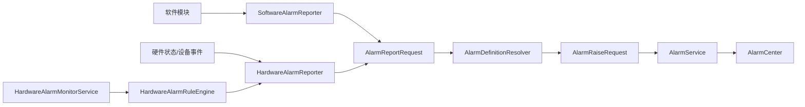

# 报警 Core 简化与数据结构设计

## 背景

当前 `ReeYin_V.Core` 的报警模块中，硬件相关类型分布在 `Hardware`、`HardwareRules`、`Monitoring` 和 `Definitions` 多个目录中。部分类型虽然命名为 `Hardware*`，实际承担的是通用报警能力，例如 `HardwareAlarmRequest` 同时被软件报警和硬件报警使用。这会造成以下问题：

- 通用报警入口被硬件命名污染，软件报警依赖硬件模型。
- 默认报警定义和硬件触发规则都叫 `HardwareAlarmRuleDefaults`，职责不清。
- 规则、监听、上报、定义分散在多个硬件目录，后续维护困难。
- 用户侧只需要“软件报警 + 可自定义硬件报警”，不需要暴露过多内部治理/硬件实现概念。

## 目标

1. 将通用报警数据结构从硬件命名中抽离出来。
2. 保留软件报警和硬件报警两条入口。
3. 保留硬件自定义触发规则能力。
4. 尽量兼容已有表、已有服务和 AlarmCenter 页面，不做破坏性迁移。
5. 让后续代码表达为“报警系统支持硬件来源”，而不是“报警系统就是硬件报警系统”。

## 非目标

- 不删除现有历史报警记录。
- 不强制迁移数据库表名。
- 不重做报警中心整体 UI。
- 不删除硬件状态监听逻辑。

## 推荐结构

```text
Services/Alarm
├─ Models
│  ├─ AlarmReportRequest.cs
│  ├─ AlarmRaiseRequest.cs
│  ├─ AlarmInfo.cs
│  └─ AlarmEnums.cs
├─ Definitions
│  ├─ AlarmDefinitionInfo.cs
│  ├─ AlarmDefinitionService.cs
│  ├─ AlarmDefinitionResolver.cs
│  └─ DefaultAlarmDefinitions.cs
├─ Hardware
│  ├─ HardwareAlarmReporter.cs
│  ├─ IHardwareAlarmReporter.cs
│  ├─ HardwareAlarmCodes.cs
│  ├─ HardwareAlarmSources.cs
│  └─ HardwareAlarmCategories.cs
├─ HardwareRules
│  └─ 保留现有实现，后续逐步抽象为 AlarmTriggerRule
├─ Monitoring
│  └─ 保留硬件状态监听
└─ Software
   └─ SoftwareAlarmReporter.cs
```

第一阶段不移动大量文件，优先修正核心数据结构和命名依赖，降低风险。

## 数据结构

### AlarmReportRequest

`AlarmReportRequest` 是软件报警和硬件报警统一使用的上报请求。

```csharp
public sealed class AlarmReportRequest
{
    public string Code { get; set; } = string.Empty;
    public string Source { get; set; } = string.Empty;
    public string SourceType { get; set; } = string.Empty;
    public string Location { get; set; } = string.Empty;
    public string Operation { get; set; } = string.Empty;
    public string Message { get; set; } = string.Empty;
    public Exception? Exception { get; set; }
    public AlarmSeverity? Severity { get; set; }
    public bool? NeedAcknowledge { get; set; }
    public bool? AllowManualClear { get; set; }
    public string? SuggestedAction { get; set; }
    public AlarmPopupMode? PopupMode { get; set; }
    public int? PopupThrottleSeconds { get; set; }
    public IDictionary<string, object?> ExtraData { get; set; }
}
```

### HardwareAlarmRequest 兼容策略

保留 `HardwareAlarmRequest`，但改为继承或适配 `AlarmReportRequest`，并标记为过时。这样外部仍可编译，内部逐步改用 `AlarmReportRequest`。

```csharp
[Obsolete("Use AlarmReportRequest for software and hardware alarm reporting.")]
public sealed class HardwareAlarmRequest : AlarmReportRequest
{
}
```

### AlarmDefinitionInfo

报警定义继续表示“报警是什么”和“报警策略”，不承担触发条件职责。

关键字段：

- `Code`：报警编码。
- `Name`：报警名称。
- `Category`：分类。
- `Severity`：等级。
- `NeedAcknowledge`：是否必须确认。
- `AllowManualClear`：是否允许手动清除。
- `PopupMode`：不弹窗、Growl 提示、模态确认。
- `PopupThrottleSeconds`：弹窗节流时间。
- `SuggestedAction`：处理建议。

### HardwareAlarmRuleInfo

硬件自定义触发规则第一阶段保留现有 `HardwareAlarmRuleInfo`，因为它已经与数据库、页面和监听服务绑定。后续可平滑抽象为 `AlarmTriggerRuleInfo`。

规则只负责“什么时候触发/清除报警”，报警等级、弹窗、确认策略仍从 `AlarmDefinitionInfo` 获取。

## 报警数据流



## 实施步骤

1. 新增 `Models/AlarmReportRequest.cs`。
2. 将 `HardwareAlarmRequest` 改成兼容包装。
3. 将 `AlarmDefinitionResolver` 和 `AlarmDefinitionService.BuildRaiseRequest` 改为使用 `AlarmReportRequest`。
4. 将 `SoftwareAlarmReporter` 内部改为创建 `AlarmReportRequest`，解除软件报警对硬件模型的依赖。
5. 将 `HardwareAlarmReporter` 内部改为使用 `AlarmReportRequest`，接口可保留兼容重载。
6. 将硬件默认报警定义改名为 `DefaultAlarmDefinitions`，保留旧类转发，避免现有调用失败。
7. 将 AlarmCenter 中的“硬件规则”展示文案改为“自定义触发规则”，降低误解。

## 验证

- 构建 `Application/ReeYin.AlarmCenter/ReeYin.AlarmCenter.csproj`。
- 静态检查 `SoftwareAlarmReporter` 不再引用 `Alarm.Hardware.HardwareAlarmRequest`。
- 静态检查 `AlarmDefinitionResolver` 接收 `AlarmReportRequest`。
- 静态检查旧 `HardwareAlarmRequest` 仍存在，以兼容外部调用。

