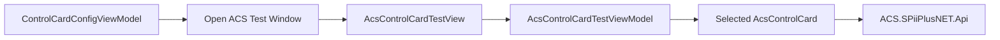

# ACS Control Card Test Page Design

Date: 2026-06-15

## Goal

Add an ACS-specific test window for `ReeYin_V.Hardware.ControlCard.ACS` so developers can validate communication, ACSPL+ buffers, IO, and axis motion from separate tabs without mixing test actions into persistent configuration editing.

## Scope

- Add `AcsControlCardTestView` as a standalone WPF window in the ACS project.
- Add `AcsControlCardTestViewModel` to orchestrate test actions through the selected `AcsControlCard` instance.
- Add an entry point from the existing ACS configuration window.
- Reuse existing `AcsControlCard` APIs where available.
- Add small public helper methods only where the ACS test UI needs functionality that is already present internally, such as transaction and status snapshots.
- Add tests for ViewModel binding/command availability and non-hardware helper behavior.

## Out Of Scope

- Do not add a pure software mock control card in this change.
- Do not refactor the whole ACS adapter or shared `ControlCardBase` architecture.
- Do not implement a generic ZMotion/Googol-compatible motion-card test tool.
- Do not change production motion safety rules or existing home/PEG behavior.

## User Flow

1. User opens the normal Control Card configuration area.
2. User selects an ACS card.
3. User clicks an ACS test button.
4. `AcsControlCardTestView` opens with the selected card bound to its ViewModel.
5. User works through tabbed test pages:
   - Communication
   - Transaction
   - Buffer Script
   - IO Test
   - Axis Motion
   - Interpolation / PEG (minimal diagnostics if the existing ACS APIs support it safely)

## Tabs

### Communication

Shows card name, connection mode, connection state, and basic action buttons:

- Initialize/connect selected card.
- Close/disconnect selected card.
- Refresh state.
- Append each operation result to a log area.

### Transaction

Provides a command input and response output:

- Default command: `?SYSINFO(13)`.
- Execute calls a public `AcsControlCard.TryTransaction(command, out response, out message)` wrapper.
- Empty commands are rejected by the ViewModel.

### Buffer Script

Reuses existing ACS buffer methods:

- `TryUploadProgramBuffer`
- `TryLoadProgramBuffer`
- `TryCompileProgramBuffer`
- `TryRunProgramBuffer`
- `TryStopProgramBuffer`
- `GetProgramBufferDiagnostics`

The tab has buffer number, optional run label, script editor, status text, and buttons.

### IO Test

Uses existing IO methods:

- Refresh input bit array with `GetAllInput`.
- Refresh output bit array with `GetAllOutput`.
- Set a single output with `SetSpecifiedIO`.
- Read a single input/output with `GetSpecifiedIO`.

The tab exposes selected IO index and output level, plus simple text snapshots of bit states.

### Axis Motion

Uses existing motion methods:

- `SetAxisEnabled`
- `Move`
- `JogAxis`
- `MoveAbsoluteAxis`
- `Stop`
- `ResetFeedbackPosition`
- `GetAllPosInfos`

The tab exposes axis selection, relative distance, absolute target, jog step, speed mode, and status text. Jog stop is represented by an explicit stop command instead of mouse-down/mouse-up logic to keep the test page simple and deterministic.

### Interpolation / PEG

This tab is optional-minimal for this change. It may provide only safe diagnostic buttons and parameter inputs that call existing `LineInterpoMoving`, `ArcInterpoMoving`, and PEG/DataCollection helpers if the existing API shape is straightforward. If this area would require broad new models or risky defaults, leave the tab present with a clear message and defer detailed implementation.

## Architecture

The test page follows the current ACS configuration-window pattern:

- `Views/AcsControlCardTestView.xaml`
- `Views/AcsControlCardTestView.xaml.cs`
- `ViewModels/AcsControlCardTestViewModel.cs`

The ViewModel inherits `BindableBase` and uses `DelegateCommand`, matching `AcsControlCardConfigViewModel`. It receives the selected card object through constructor or `SetCard(object?)` and never creates a new card instance for tests.

The view is a WPF `Window`, not a dynamic node page. It uses shared ReeYin-V UI styles:

- `GeneralButtonStyle`
- `DefaultDataGridStyle` if list grids are needed
- `TabControlStyle` / `SingleTabItemStyle`
- `DynamicResource` theme brushes where practical

## Data Flow

## Error Handling

- Every command catches exceptions in the ViewModel command path or relies on existing ACS wrapper methods returning `(bool, message)`.
- The UI writes human-readable status messages with timestamps.
- Commands reject missing card, disconnected card for online-only actions, invalid buffer number, invalid IO index, missing axis selection, and non-finite movement values.
- Test actions must not mark operations as successful unless the underlying card method returns true.

## Testing

Add tests to `Hardware/ControlCard/ReeYin_V.Hardware.ControlCard.ACS.Tests/Program.cs`:

- The ACS test ViewModel type is discoverable.
- The ViewModel accepts an `AcsControlCard` and exposes the same card/options/state.
- The expected tab command properties are non-null.
- Invalid transaction command returns a failure status without requiring hardware.
- Invalid IO/output/axis inputs fail predictably without requiring hardware.

Build and validation commands:

- `dotnet build Hardware\ControlCard\ReeYin_V.Hardware.ControlCard.ACS\ReeYin_V.Hardware.ControlCard.ACS.csproj --no-restore /p:SolutionDir=E:\Company\工作目录\ReeYin-V\ReeYin-V\`
- `dotnet build Hardware\ControlCard\ReeYin_V.Hardware.ControlCard.ACS.Tests\ReeYin_V.Hardware.ControlCard.ACS.Tests.csproj --no-restore /p:SolutionDir=E:\Company\工作目录\ReeYin-V\ReeYin-V\`
- `Hardware\ControlCard\ReeYin_V.Hardware.ControlCard.ACS.Tests\bin\Debug\net8.0-windows\ReeYin_V.Hardware.ControlCard.ACS.Tests.exe`

## Constraints

- Current workspace is not a Git repository.
- Parent directory contains `.svn`, but `svn` is not available in this environment, so this spec cannot be committed here.
- Some existing files contain mojibake Chinese strings; new files should use stable ASCII identifiers and avoid changing unrelated localized text.
