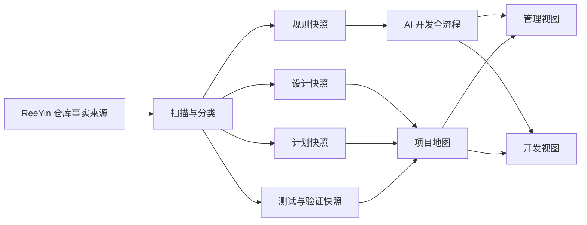

# ReeYin AI 工作流 Obsidian Vault 设计

## 目标

在用户桌面创建独立的 Obsidian Vault，将 ReeYin-V 的 AI 开发治理流程与现有设计、实施计划、测试资料组织成可直接浏览的知识库。Vault 同时面向项目负责人和开发人员，提供管理视图与开发视图两个入口。

## 成功标准

- 用户可以在 Obsidian 中直接将输出目录作为 Vault 打开。
- 首页提供管理视图和开发视图两个清晰入口。
- AI 开发流程覆盖任务定义、调查、风险分级、设计、实现、验证、自审、评审和交付。
- 现有设计、计划、测试和规则资料以可追溯快照呈现，并保留源路径与快照时间。
- 设计、计划和测试资料按确定性规则建立双向链接；不确定关系明确标记，不伪造状态或风险。
- Markdown、YAML、内部链接和 Mermaid 内容经过 R0 文档验证。

## 非目标

- 不修改 ReeYin-V 的运行代码、配置、公共契约或设备行为。
- 不修改仓库中的原始设计、计划、测试和规则文档。
- 不把无法从原文确认的项目进度、风险等级或评审状态推断为事实。
- 不转换 Word 文档内容，也不执行文档生成脚本。
- 不建立自动后台同步、Obsidian 插件或网络服务。

## 风险等级

本变更按 R0 处理：输出为仓库外的文档副本与派生索引，不改变运行行为。主要风险是快照过期、链接失效、编码异常和派生结论被误认为原始事实。

缓解措施：所有快照记录源路径和快照时间；派生笔记明确标注；关系仅按确定性规则建立；异常和缺失资料进入来源清单；输出到新目录且不覆盖既有 Vault。

## 方案选择

采用“双入口混合知识库”：复制相关 Markdown 为 Vault 内可导航快照，同时生成流程、主题、时间和映射索引。

未采用方案：

- 仅创建外部链接索引：Vault 外文件的双向链接、可移植性和路径稳定性较差。
- 镜像整个 `docs`：噪声和同步成本较高，不利于负责人快速理解 AI 工作流。

## 目录结构

```text
ReeYin AI 工作流/
├─ 00-入口/
│  ├─ 首页.md
│  ├─ 管理视图.md
│  └─ 开发视图.md
├─ 01-工作流/
│  ├─ AI开发全流程.md
│  ├─ 风险分级-R0至R4.md
│  ├─ 验证与证据门禁.md
│  └─ 人类授权边界.md
├─ 02-项目地图/
│  ├─ 全部主题.md
│  ├─ 按时间浏览.md
│  ├─ 按领域浏览.md
│  └─ 设计与计划对应表.md
├─ 03-设计快照/
├─ 04-实施计划快照/
├─ 05-测试与验证快照/
├─ 06-规则快照/
├─ 07-模板/
│  ├─ AI任务卡.md
│  ├─ 风险评估.md
│  ├─ 验证证据.md
│  └─ 交付检查表.md
└─ 99-元数据/
   ├─ 来源清单.md
   ├─ 同步说明.md
   └─ 词汇表.md
```

## 入口职责

### 管理视图

按主题、时间、风险、资料覆盖和人工门禁展示项目地图。只展示能够从原文或文件结构确认的信息；缺少设计、计划、验证或评审证据时显示资料缺口。

### 开发视图

沿 AI 开发完整生命周期导航到对应规则、检查表、模板和历史案例，使开发人员能够从任务定义逐步进入调查、风险分级、设计、实现、验证、自审、评审和交付。

## 事实来源与分类

| 来源 | Vault 分类 | 处理方式 |
| --- | --- | --- |
| `AGENTS.md` | 规则快照 | 保留正文并添加来源信息 |
| `CONTRIBUTING.md` | 规则快照 | 保留正文并添加来源信息 |
| `docs/development/*.md` | 规则快照 | 保留正文并添加来源信息 |
| `docs/superpowers/specs/*.md` | 设计快照 | 保留正文并添加元数据与内部链接 |
| `docs/superpowers/plans/*.md` | 实施计划快照 | 保留正文并添加元数据与内部链接 |
| `docs/testing/*.md` | 测试与验证快照 | 保留正文并添加元数据与内部链接 |
| `docs/superpowers/plans/*` 中的非 Markdown 文件 | 来源清单 | 只登记，不转换、不执行 |

## 元数据

每份快照使用统一 YAML 属性：

```yaml
type: design | plan | test | rule
domain: unknown # 仅按确定性主题规则归类
date: 2026-07-13 # 仅使用文件名中明确存在的日期
source_path: docs/superpowers/specs/example.md
snapshot_at: 2026-07-13T14:30:00+08:00
risk: unknown # 仅使用原文明示值
status: unknown # 仅使用原文明示值
```

派生笔记必须标记 `type: derived` 和 `snapshot_at`，并说明其内容来自快照索引，不是仓库原始规范。

## 关联规则

1. 优先使用设计与计划文件名中去除日期和固定后缀后的主题标识进行精确关联。
2. 测试资料仅在主题标识明确对应时建立确定链接。
3. 标题和日期只用于辅助展示，不单独作为确定关联依据。
4. 模糊匹配进入“可能相关”列表，不创建确定关系。
5. 没有对应设计、计划或验证资料时显示“未发现对应项”，不推断项目未实施或未验证。

## 内容流



## 异常与冲突处理

- 文件无法读取：在来源清单中标记 `unreadable`，不生成伪快照。
- 编码异常：保留来源记录；只有可靠解码后才生成快照。
- 快照文件重名：用原文件名和日期消歧，不覆盖。
- 目标桌面存在同名 Vault：创建带时间戳的新目录，不覆盖既有内容。
- 元数据无法确认：使用 `unknown` 或空值，不猜测。
- 规则内容冲突：保留各自原文，并在派生笔记中按仓库规定的规则优先级说明，不擅自裁决未定义冲突。

## 验证设计

R0 验证按以下顺序执行并记录新鲜证据：

1. 清点来源文件数量、成功快照数量、未读取数量和非 Markdown 登记数量。
2. 检查所有生成的 Markdown 文件可按 UTF-8 读取。
3. 检查 YAML frontmatter 的边界和必需字段。
4. 检查 Vault 内部 Markdown/Wiki 链接的目标存在；明确允许的外部源路径除外。
5. 检查 Mermaid 代码块成对闭合。
6. 人工抽查首页、管理视图、开发视图，以及至少三个“设计 → 计划 → 测试”或缺口链路。

验证仅证明文档结构和链接完整性，不证明历史计划已实施、测试已执行或真实设备状态。

## 兼容性

- 仓库原文件不变，因此不影响 API、配置、数据、Recipe、Output、缓存、UI、模块加载或设备行为。
- Vault 使用标准 Markdown、YAML、Wiki 链接和 Mermaid，避免依赖第三方 Obsidian 插件。
- 绝对源路径只用于当前机器追溯；Vault 内导航全部使用相对或 Wiki 链接。

## 更新与回滚

本次输出是一次性快照。更新时应生成新的快照时间并重新执行来源清点与链接验证，不把旧快照静默视为最新资料。

回滚方式为关闭 Obsidian 并删除本次新建的桌面 Vault 目录。执行删除属于独立的破坏性动作，必须由用户明确授权；仓库无需回滚，因为实施阶段不修改仓库原始资料。

## 交付边界

- 实施阶段只在桌面新建 Vault，不修改 ReeYin-V 仓库内容。
- 不提交、不推送、不发布、不部署，也不执行真实设备或生产数据操作。
- 设计文档保存在仓库中供审阅，但依据仓库 AI 限制不由 AI 创建 Git 提交。
